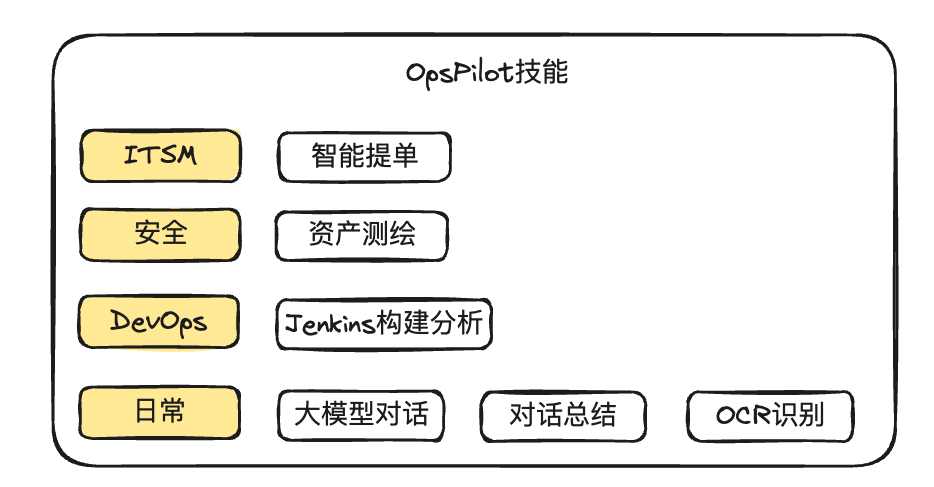

# OpsPilot

OpsPilot是WeOps团队开源的一个基于深度学习与LLM技术的AI运维领域领航员，让运维预案变得可交互，让本地运维知识变得可泛化、可推理

OpsPilot支持以ChatBot的形态与Web应用集成，主要提供以下能力：

* 运维能力沉淀：通过将运维的知识、运维技能、排查动作进行沉淀，在解决问题的时候以领航员的形态，通过对话的方式指引用户解决运维问题
* 本地知识问答：通过对本地知识、互联网知识进行索引，结合LLM的能力，回复用户的各种运维问题
* LLM聊天：当问题超出OpsPilot能够处理的范围的时候，使用LLM的能力解决各种长尾问题

# 特性

* [DevOps]支持Jenkins对接:
    * 通过ChatBot触发Jenkins任务： 触发流水线、查看流水线、检索流水线
    * Jenkins构建通知,当构建出现异常的时候，通知到群组中，告诉运维人员构建失败的原因与修复建议
* [安全]支持资产测绘的能力，能够对目标资产进行资产测绘，生成资产测绘报告
* [日常]支持FastGPT对接,提供大模型的编排与知识管理能力
* [日常]企业微信通道支持OCR能力，支持识别用户上传的图片，并对图片进行回复
* [日常]支持多种对话通道：WebChat、Slack 、企业微信、微信

* [日常]Chitchat能力：支持闲聊、问候、打招呼等功能
* [日常]支持聊天对话总结：对话内容进行总结，生成对话总结文档

# 环境变量

| 变量名                         | 说明                               | 默认值                    |
|-----------------------------|----------------------------------|------------------------|
| RUN_MODE                    | 运行模式                             | dev                    |
| CHATGPT_MODEL_MAX_HISTORY   | 对话历史记录最大长度（用于对话总结技能）             | 5                      |
| CELERY_BROKER_URL           | Celery Broker地址,用于长周期任务技能        |                        |
| RASA_CREDENTIALS            | Rasa认证配置文件名称，Celery任务会使用         | credentials.yml        |
| RASA_ACTION_SERVER_URL      | Rasa Action Server地址，Celery任务会使用 | http://localhost:5055/ |
| FASTGPT_ENDPOINT            | FastGPT服务地址                      |                        |
| FASTGPT_KEY                 | FastGPT服务的Key，用于LLM回复技能          |                        |
| FASTGPT_CONTENT_SUMMARY_KEY | FastGPT服务的Key，用于对话总结技能           |                        |
| ENABLE_JENKINS_SKILL        | 是否启用Jenkins技能                    | false                  |
| JENKINS_URL                 | Jenkins服务地址                      |                        |
| JENKINS_USERNAME            | Jenkins用户名                       |                        |
| JENKINS_PASSWORD            | Jenkins密码                        |                        |

# 讨论群

## Star History

