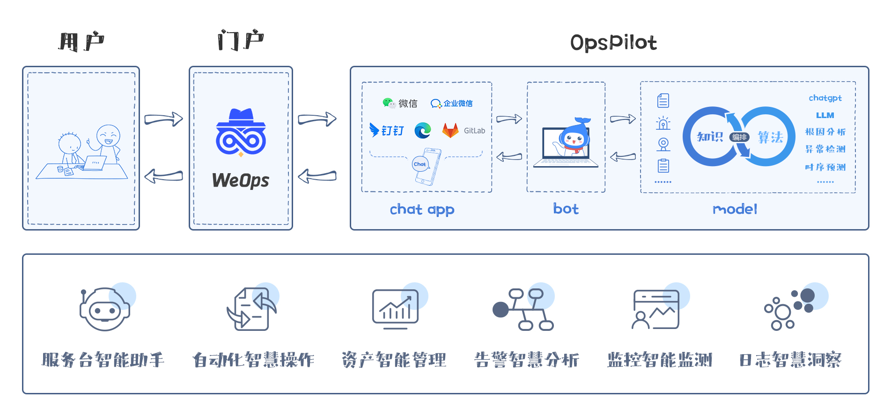

# OpsPilot

OpsPilot is an open source intelligent operation and maintenance assistant based on deep learning and LLM technology developed by the WeOps team. In the form of an operation and maintenance brain, it links various operation and maintenance systems to provide intelligent operation and maintenance capability support.

It mainly supports Web, enterprise WeChat and other channels, providing users with extended capabilities in three directions: `Intelligent Q&A`, `ChatOps`, and `Intelligent Guidance`.

# Documents

https://wedoc.canway.net/opspilot/

# Discus Group

# Inspire by

* [Langchain-Chatchat](https://github.com/chatchat-space/Langchain-Chatchat)
* [QAnything](https://github.com/netease-youdao/QAnything)
* [ragflow](https://github.com/infiniflow/ragflow)

# Star History

