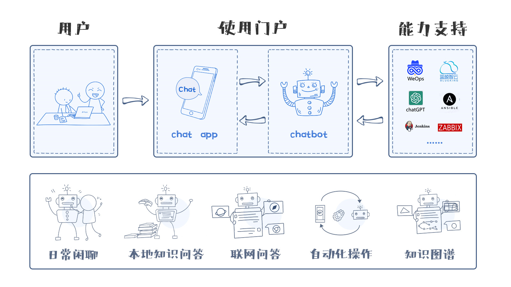

# OpsPilot


OpsPilot是WeOps团队开源的一个基于深度学习与LLM技术的AI运维领域领航员，让运维预案变得可交互，让本地运维知识变得可泛化、可推理

OpsPilot支持以ChatBot的形态与Web应用集成，主要提供以下能力：

* 运维能力沉淀：通过将运维的知识、运维技能、排查动作进行沉淀，在解决问题的时候以领航员的形态，通过对话的方式指引用户解决运维问题
* 本地知识问答：通过对本地知识、互联网知识进行索引，结合LLM的能力，回复用户的各种运维问题
* LLM聊天：当问题超出OpsPilot能够处理的范围的时候，使用LLM的能力解决各种长尾问题



# 场景化模型

> 场景化模型处于闭源状态，需要的小伙伴可以通过添加“小嘉”微信，加入官方沟通群，获取专业的场景化模型哦
>


# 场景

## ChatOps场景

### Jenkins

OpsPilot支持驱动Jenkins，具备以下能力：

* 列出流水线
* 查找流水线
* 触发流水线构建：支持当流水线构建失败后，使用LLM分析构建失败的原因以及修复方法

## LLM场景

* 闲聊模式
  

* 本地知识问答
  

* 联网问答
  

# 部署

```
export OPENAI_ENDPOINT=
export OPENAI_KEY=
cd ./support-files/
docker-compose up -d
```

# 开发环境搭建

使用 Python 3.10版本

```
virtualenv venv -p python3.10
pip install -r ./requirements.txt
pip install -r ./requirements-test.txt

python ./ops_pilot_cli.py init_data
```

索引本地知识

```
python ./ops_pilot_cli.py embed_local_knowledge --knowledge_path=
```

测试本地知识

```
python ./ops_pilot_cli.py query_embed_knowledge
```

启动OpsPilot NLU 服务

```
rasa run --enable-api --cors "*"
```

启动OpsPilot Actions服务

```
rasa run actions --auto-reload
```

# 常见问题

## 如何启用WebSocket的JWT验证

修改`credentials.yml`,添加`jwt_key`、`jwt_method`配置即可

```
socketio:
  user_message_evt: user_uttered
  bot_message_evt: bot_uttered
  session_persistence: true
  jwt_key: key
  jwt_method: HS256
```

## 如何将docusaurus的网页转换成PDF文件

```
npx docusaurus-prince-pdf -u xxx
```

## Mac如何安装requirements.txt

```
export HNSWLIB_NO_NATIVE=1  
pip install -r requirements.txt
```

## 如何使用MySQL作为Tracker

```
tracker_store:
  type: SQL
  dialect: "mysql+pymysql"
  url: ""
  db: "ops-pilot"
  username: "root"
  password: ""
```

# 参数说明

| 参数                     | 说明                             | 可选配置   |
|------------------------|--------------------------------|--------|
| FALLBACK_LLM           | 当OpsPilot无法处理的时候，使用LLM进行回复     | OPENAI |
| OPENAI_ENDPOINT        | OpenAI上部署模型的终结点                |        |
| OPENAI_KEY             | OpenAI上部署模型使用的秘钥               |        |
| JENKINS_URL            | Jenkins URL,启用Jenkins自动化能力需要配置 |        |
| JENKINS_USERNAME       | Jenkins 用户名,启用Jenkins自动化能力需要配置 |        |
| JENKINS_PASSWORD       | Jenkins 密码,启用Jenkins自动化能力需要配置  |        |
| BING_SEARCH_URL        | Bing Search端点                  |        |
| BIND_SEARCH_KEY        | Bing Search密码                  |        |
| VEC_DB_PATH            | 向量数据库的路径                       |        |
| RUN_MODE               | 是否以开发模式运行                      |        |
| FALLBACK_CHAT_MODE     | LLM使用本地知识库模式还是闲聊模式             |        |
| REDIS_HOST             | Redis IP地址                     |        |
| REDIS_PORT             | Redis 端口号                      |        |
| REDIS_DB               | Redis 数据库号                     |        |
| REDIS_PASSWORD         | Redis 密码                       |        |
| ENABLE_ONLINE_CHAT     | 是否开启联网知识问答                     |        |
| ENABLE_JENKINS_SKILL   | 是否启用操作Jenkins的能力               |        |
| EMBED_MODEL_NAME       | embed模型名称                      |        |
| EMBED_MODEL_CACHE_HOME | embed模型缓存路径                    |        |
| INDEXER_DB_PATH        | 倒排索引文件存放路径                     |        |

# 版本说明

## 0.4

* [新增]Word文档索引能力
* [新增]PPT文档索引能力
* [新增]新增企业微信Channel

## 0.3

* [新增]支持对接Jenkins，提供Jenkins流水线查询、列出Jenkins流水线、构建Jenkins流水线并通知的能力
* [新增]支持OpsPilot触发Jenkins流水线失败之后，调用LLM给出修复建议
* [新增] ENABLE_JENKINS_SKILL环境变量
* [优化]联网问答添加url校验
* [优化]优化联网问答的slot，仅在chat_online模式下激活

## 0.2

* Prompt配置存放至Redis中
* 采用倒排索引+语义检索两种模式，提升LLM推理准确率
* 新增联网使用GPT进行问答的能力

## 0.1

* 完成基础框架搭建
* 支持ChatGPT闲聊模式
* 支持索引目标网站、本地PDF知识，完成本地知识问答
* 支持基于Intent的运维能力整合