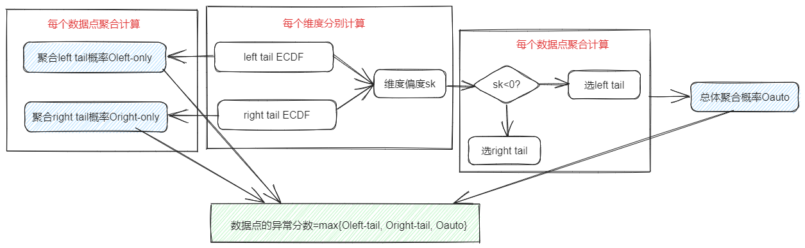

# ECOD

## 算法简介

经验累积离群值检测(Empirical Cumulative Outlier Detection, ECOD)算法是一种无监督异常检测算法，其核心思想是利用经验累积分布函数(ECDF)来估计数据的联合累积分布函数（结合同一样本不同维度的离群分数计算每个样本的离群分数），从而计算异常值的概率。该算法灵感来源于——离群值通常是出现在分布尾部的罕见事件。

## 使用场景

适用于高维度数据且希望获得解释性结果的异常检测，能够了解到哪些指标造成数据点异常的可能性高，具有较低的时间和空间复杂度，能够通过并行计算来加速处理。
## 算法原理

 

该算法首先计算每个维度（指标）的左尾ECDF和右尾ECDF，然后再计算每个维度的偏度skewness，最后基于此分别进行概率聚合。遍历每个数据点，左尾ECDF聚合得到Oleft-only，右尾聚合得到Oright-only，根据skewness决定适用左尾ECDF还是右尾ECDF计算得到Oauto，取三者最大值作为数据点的异常值，可以设置阈值筛选出异常点。

**论文链接**：<https://www.researchgate.net/publication/357552688_ECOD_Unsupervised_Outlier_Detection_Using_Empirical_Cumulative_Distribution_Functions>