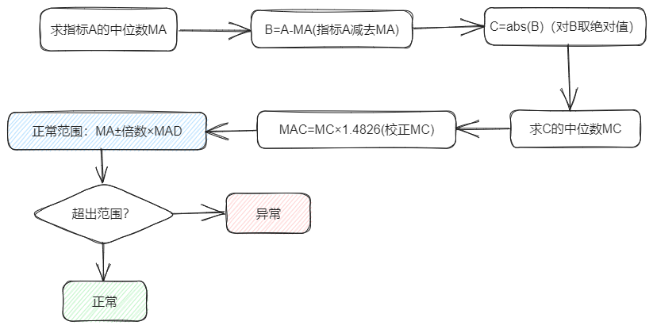

# MAD

## 算法简介

绝对中位差(MedianAbsolute Deviation, MAD)是一种次啊用计算各观测值与平均值的距离综合的检测离群值的方法。

## 使用场景

本算法适用于对单指标数值型数据进行异常值检测

## 算法原理

如上图所示，首先求得指标A的中位数MA，再用指标A所有的值分别减去MA得到变量B的值，对B的值求绝对值后再求其中位数MC，并对MC进行MAD校正得到MAD，根据MAD和MA确定正常的范围，超出此范围的数值会被认定为异常值。

* 论文原文链接: https://books.google.com/books?hl=zh-CN&lr=&id=FuuiEAAAQBAJ&oi=fnd&pg=PP1&dq=Iglewicz,+B.+and+Hoaglin,+D.C.,+1993.+How+to+detect+and+handle+outliers+(Vol.+16).+Asq+Press.&ots=SEU5R3XTQn&sig=3bGO1vTuZpQfPE8QIfX7QGyjTq8#v=onepage&q=Iglewicz%2C%20B.%20and%20Hoaglin%2C%20D.C.%2C%201993.%20How%20to%20detect%20and%20handle%20outliers%20(Vol.%2016).%20Asq%20Press.&f=false