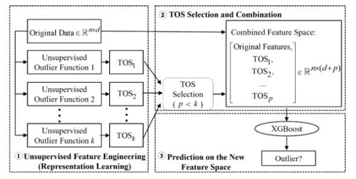

# XGBOD
## 算法简介

基于极限增强的离群值检测(Extreme Boosting Based Outlier Detection, XGBOD)算法是一种用于改进有监督异常检测的半监督集成算法，该算法通过各种无监督离群值检测函数扩充原始的特征空间，并采用贪婪算法对增广特征空间进行剪枝，以控制计算复杂度，最后用监督集成方法XGBoost作为精细化特征空间的最终输出分类器。

## 使用场景

适用于有标签或部分标签数据的异常检测，能够在高维特征空间特区和利用更多信息，能够通过调整基础无监督模型的参数产生各种准确性和多样性的TOS，适用于需要在准确性和多样性之间平衡的情况下提升性能的情况。

## 算法原理

XGBOD算法共分为三个阶段，分别是特征变换阶段、TOS选择阶段和最终预测阶段：

(1) 特征变换阶段：通过多种无监督离群值检测方法获得离群值评分TOS。算法适用不同的无监督离群值检测方法作为基础的异常评分函数，并调整它们的参数以产生不同准确性和多样性的TOS，这些TOS被看作新的特征，用于改进原始的特征空间；

(2) TOS选择阶段：从生成的TOS集合中选择一部分与原始特征进行结合。为了选择TOS，算法提出了随机选择、准确选择和平衡选择三种选择方法。随机选择可以产生较为不确定和不稳定的结果，平衡选择在具有更多特征（指标）的数据集上效果较好，而平衡选择在具有较少特征（指标）的数据集上表现更加出色。选择的TOS与原始特征结合形成了一个改进后的特征空间；

(3) 最终预测阶段：训练XGBoost分类器，输出最终异常检测结果。

**论文原文链接**：<https://arxiv.org/ftp/arxiv/papers/1912/1912.00290.pdf>