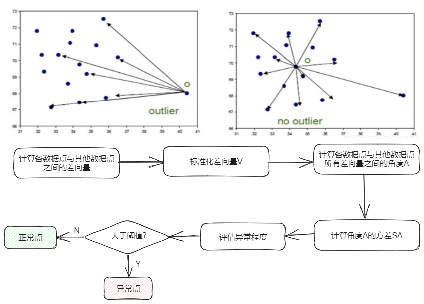

# ABOD 
 
## Algorithm introduction 
 
In high dimensions, distance is homogenized, and Angle is more stable than distance. Therefore, angle-based Outlier Detection (ABOD) focuses on the Angle formed by any three data points in a set of multivariate feature Spaces, and the circumference of the Angle is different for outliers and normal points. Therefore, the anomaly is detected 
 
## Use scenario 
 
It is suitable for high-dimensional multi-indicator anomaly detection (the number of indicators is greater than 25). The higher the data dimension, the better the algorithm performance. The smaller the number of indicators, the lower the algorithm accuracy, and the higher the time cost of the algorithm. You can measure all data points for anomalies. The higher the anomaly, the more likely it is to be an anomaly. The threshold can be adjusted based on the actual situation 
 
## Algorithm principle 
 
 
 
The main idea of the algorithm is to judge outliers by comparing the Angle of the difference vector between data points. By calculating the Angle change of the difference vector, the algorithm can capture the difference and offset between data points and other points, and then identify potential outliers. Because the algorithm does not depend on the selection of any parameter, the influence of subjective factors on the anomaly detection results can be reduced 
 
* the original link: https://www.dbs.ifi.lmu.de/Publikationen/Papers/KDD2008.pdf