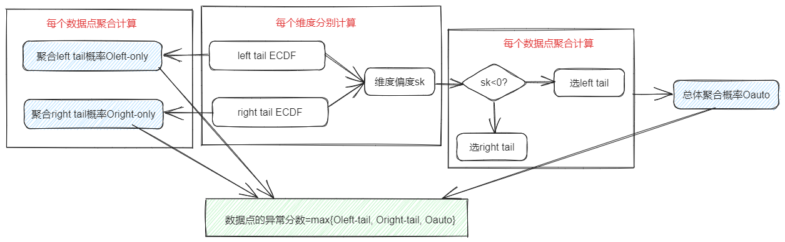

# ECOD 
 
## Algorithm introduction 
 
The Empirical Cumulative Outlier Detection (ECOD) algorithm is an unsupervised anomaly detection algorithm. The core idea is to calculate the probability of outliers by using the experience cumulative distribution function (ECDF) to estimate the joint cumulative distribution function of the data (calculating the outlier score for each sample by combining the outlier scores of different dimensions of the same sample). The algorithm was inspired by the fact that outliers are usually rare events that appear at the tail of a distribution. 
 
## Use scenario 
 
Anomaly detection for  high-dimensional data and want interpretive results , can  understand which indicators are more likely to cause data point anomalies , with low time and spatial complexity. The processing can be accelerated by parallel computation. 
## Algorithm principle 
 
  
 
The algorithm first calculates the left-tail ECDF and right-tail ECDF of each dimension (index), then calculates the skewness of each dimension, and finally performs probabilistic aggregation based on this. After traversing each data point, Oleft-only is obtained by left-tailed ECDF aggregation, and Oright-only is obtained by right-tailed ECDF aggregation. Oauto is calculated according to skewness, and the maximum values of the three are taken as the outliers of the data points, and the threshold can be set to screen out the outliers. 
 
** Paper Links ** : <https://www.researchgate.net/publication/357552688_ECOD_Unsupervised_Outlier_Detection_Using_Empirical_Cumulative_Distr ibution_Functions>