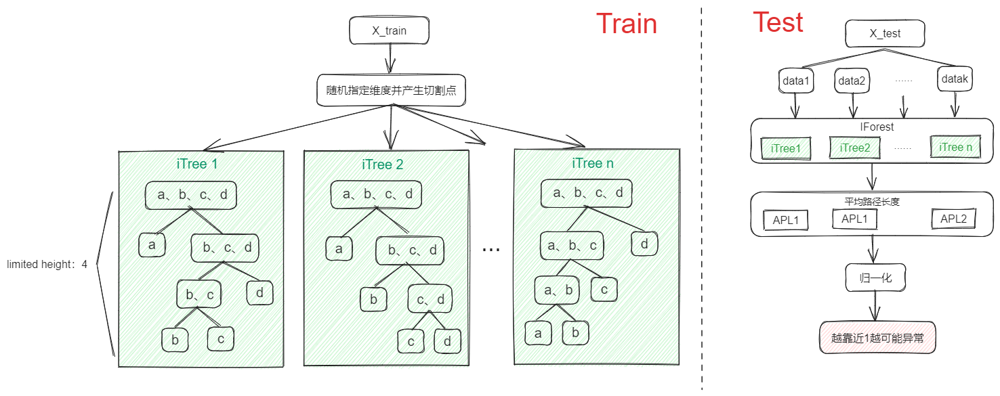

# IForest 
 
## Algorithm introduction 
 
Isolation Forest (IForest) is an Ensemble based unsupervised anomaly detection method with linear time complexity and high accuracy. IForest uses an efficient strategy in that dense clusters need to be cut many times to separate each data point into a separate subspace, while low-density points can easily be split into a subspace. 
 
## Use scenario 
It is suitable for anomaly detection of  continuous data , and can be used for  data sets with large  data scale (the number of trees can be increased to increase the algorithm stability, each tree is independent of each other.  is not applicable to data with too large dimensions , which will reduce the reliability of the algorithm. 
 
## 3. Algorithm principle 
 
 
The algorithm adopts a two-stage process for anomaly detection. The first stage is the training stage, which subsamples the training set data and divides the training set by recursion until the data points are isolated or reach limited hegiht, so as to construct a series of isolated trees (ITrees). During the construction of each isolated tree, the segmentation index is randomly selected, and the segmentation value is generated between the maximum and minimum index value. The second stage is the evaluation stage. Each data point is passed through each iTree, and the Average Path Length (APL) of each data point on all itrees is calculated to measure the abnormal score, and the abnormal score is obtained by normalizing APL in the range of 0-1. An anomaly score much less than 1 indicates a definite normal, and the closer it is to 1, the more likely it is to be an outlier (outliers are far from dense clusters and can easily be assigned to a subspace, so the average path length will be shorter, such as A in iTree1). 
 
**the original link**: <https://www.researchgate.net/publication/224384174_Isolation_Forest>