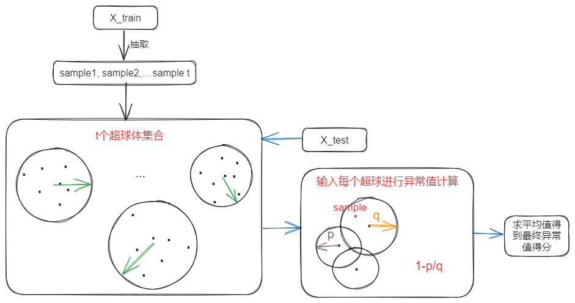

# INNE 
 
## Algorithm introduction 
 
In order to overcome the problem that IForest algorithm is not good at dealing with local relatively sparse points in numerical data and is not suitable for data with particularly high dimensions, etc., Isolation‐Based Anomaly Detection Using Nearest‐Neighbor Ensembles (INNE) using isolation mechanism and nearest ‐ neighbor ensembles (INNE), The isolation mechanism is realized by cutting data space by multi-dimensional hypersphere, and the local distribution of data is considered. 
 
## Use scenario 
Applicable to anomaly detection of  low correlation index data , this algorithm can well adapt to abnormal situations in different data sets, and can conveniently handle  high-dimension data  to capture local anomalies in high-dimensional space. 
 
## Algorithm principle 
  
 
In the training stage, t subsamples are randomly selected from the training set to build a hypersphere set. The nearest neighbor search is carried out for each data point to find the nearest neighbor, and the minimum hypersphere radius is calculated based on the attributes of the neighbor, so that the hypersphere can overcontain the current data point and its neighbors. In the test phase, the data points of each test are put into each hypersphere to calculate the isolation score, which is calculated according to the ratio of the relative size of the hypersphere in which it is located to the size of the neighbor hypersphere, and then the average value is taken as the final outlier. 
 
**Link to original paper** : <https://www.researchgate.net/profile/Tharindu-Bandaragoda/publication/322359651_Isolation-based_anomaly_detection_using_nearest-neighbor_ensembles_iNNE/links/5e91651092851c2f5294c5ac/Isolation-based-anomaly-detection-using-nearest-neighbor-ensembles-iNNE.pdf>