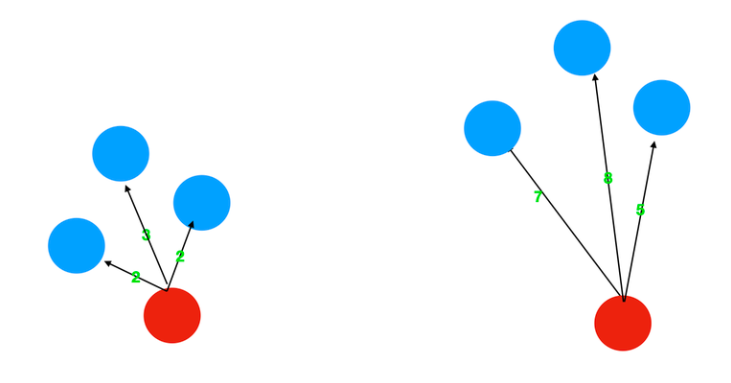

# KNN 
 
## Algorithm introduction 
 
K-NearestNeighbor (KNN) algorithm is a distance-based unsupervised machine learning anomaly detection algorithm. Outliers must be far away from most normal data points. Based on this idea, KNN only needs to compute the distance between each data point and its nearest K samples in turn, and then compare the distance with the threshold value to obtain the outliers. 
## Use scenario 
 
It is suitable for anomaly detection when  does not know the data distribution , and  is not suitable for high-dimension data , and because only outliers can be found and abnormal clusters cannot be found, each calculation distance needs to traverse the entire data set, and the time complexity is high. 
 
## Algorithm principle 
  
 
(1) Calculate the distance between each data point in the data set and each other, using Euclidean distance as the distance measure by default; 
 
(2) Sort in order of increasing distance, select K points with the smallest distance from the current point (K value is selected according to the specific needs of the problem and experimental experience, the default is 5) 
 
(3) Calculate the distance between the current point and K neighbors, and take the mean or median value and maximum value (set by the parameter method) as the outlier. The larger the outlier, the more likely it is to be the outlier. 
 
**Links to**: <https://dl.acm.org/doi/pdf/10.1145/342009.335437>