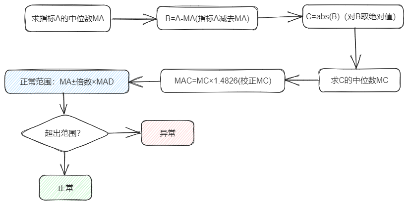

# MAD

## Algorithm Introduction

Median Absolute Deviation (MAD) is a comprehensive method for detecting outliers by calculating the distance between each observation and the mean.

## Usage scenarios

This algorithm is suitable for outlier detection on single-index numerical data.

## Algorithm principle

As shown in the figure above, first find the median MA of indicator A, then subtract MA from all the values ​​of indicator A to get the value of variable B. Find the absolute value of B and then find its median MC, and MC performs MAD correction to obtain MAD. The normal range is determined based on MAD and MA. Values ​​outside this range will be identified as abnormal values.

* Link to the original paper: https://books.google.com/books?hl=zh-CN&lr=&id=FuuiEAAAQBAJ&oi=fnd&pg=PP1&dq=Iglewicz,+B.+and+Hoaglin,+D.C.,+1993.+How+to+detect+and+handle+outliers+(Vol.+16).+Asq+Press.&ots=SEU5R3XTQn&sig=3bGO1vTuZpQfPE8QIfX7QGyjTq8#v=onepage&q=Iglewicz%2C%20B.%20and%20Hoaglin%2C%20D.C.%2C%201993.%20How%20to%20detect%20and%20handle%20outliers%20(Vol.%2016).%20Asq%20Press.&f=false