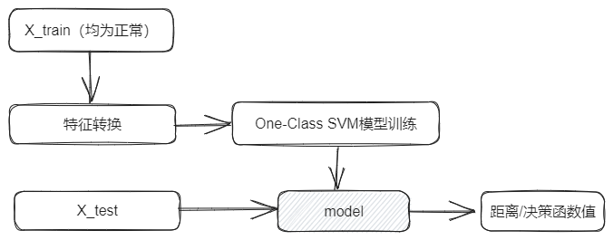

# One-Class SVM 
## Algorithm introduction 
 
One-class SVM is a classical unsupervised machine learning algorithm in which there is only One Class of training data, the normal sample, and no abnormal sample. The goal of a One-Class SVM is to learn a hyperplane that separates the positive sample from the origin while maximizing the distance between the hyperplane and the origin. Unlike the ordinary binary classification problem, the one-class SVM has only One Class, and not all of the classes are judged as "exceptions". 
 
## Use scenario 
It is suitable for anomaly detection when  has little or no abnormal data, and there is a large gap between normal and abnormal samples in the feature space . 
 
## Algorithm principle 
  
 
In the training stage of the algorithm, it is first necessary to collect the data of normal samples, which do not contain abnormal samples, map the data to a high-dimensional feature space with appropriate kernel functions, and train the One-Class SVM model in the high-dimensional feature space to separate the normal samples from the origin and maximize the interval between them. In the prediction stage, for each new sample, the trained model is used to calculate the distance from the sample to the hyperplane or the value of the decision function. If the value of the distance or decision function exceeds the preset threshold, it is classified as an abnormal sample. 
 
**the original link** : <https://sci-hub.hkvisa.net/10.1162/089976601750264965>