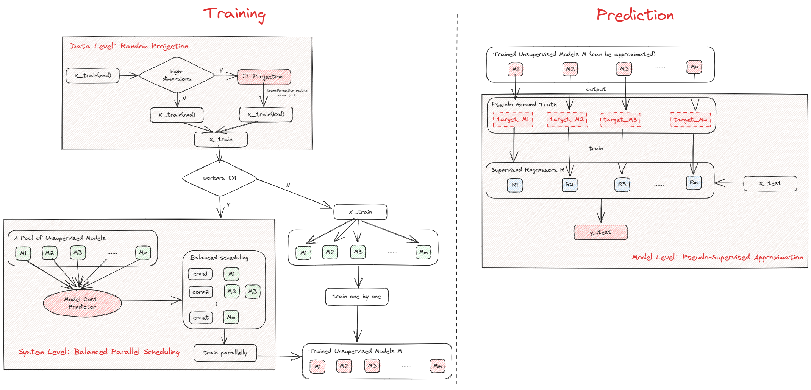

# Suod 
 
## Algorithm introduction 
 
Training or using a large number of unsupervised models to make predictions will face huge overhead problems, especially on high-dimensional and big data, and in many cases even convergence is impossible, so SUOD is proposed. SUOD is a heterogeneous unsupervised model. With JL Projection as the solution to high-dimensional problems, approximate regressor is used instead of unsupervised models to accelerate the prediction process, and balanced parallel scheduling is performed for model training to improve system performance. 
 
## Use scenario 
 
This algorithm is suitable for the case that the data dimension is high and the processing speed is required 
 
## Algorithm principle 
 
 
To put it simply, after inputting x_train training data, it will first reduce the dimension of high-dimensional training data, and then train multiple basic models in parallel and get the weight of each model, and save the y_train obtained by training. x_train and y_train are then used to train the approximate model (using random forest by default). If the approximate model performs better than the base model, the base model will be replaced. When x_text is input to detect anomalies in the data, the trained approximate model/ basic model will be called to calculate the anomaly score for each sample, weighted to obtain the final integrated anomaly score, and then compare the anomaly score with the threshold value. 
 
**Links to** : <https://www.andrew.cmu.edu/user/yuezhao2/papers/21-mlsys-suod.pdf>