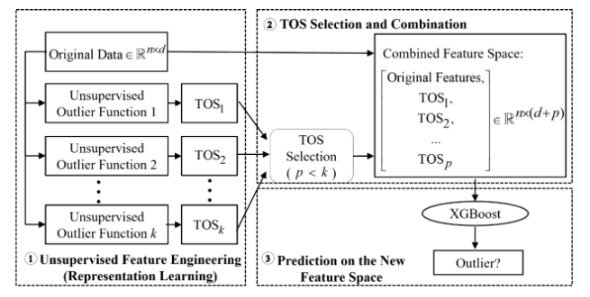

# XGBOD 
## Algorithm introduction 
 
Extreme Boosting Based Outlier Detection (XGBOD) algorithm is a semi-supervised ensemble algorithm for improving supervised outlier detection, which extends the original feature space by various unsupervised outlier detection functions. The greedy algorithm is used to prune the augmented feature space to control the computational complexity. Finally, XGBoost is used as the final output classifier of the refined feature space. 
 
## Use scenario 
 
Applicable to anomaly detection of  labeled or partially labeled data , capable of detecting and utilizing more information in high-dimensional feature space, capable of generating various accuracy and diversity of TOS by adjusting the parameters of the basic unsupervised model. Suitable for situations where performance needs to be improved with a balance between   accuracy and variety. 
 
## Algorithm principle 
 
 
XGBOD algorithm is divided into three stages, which are feature transformation stage, TOS selection stage and final prediction stage: 
 
(1) Feature transformation stage: The outlier score TOS is obtained through a variety of unsupervised outlier detection methods. The algorithm applies different unsupervised outlier detection methods as the basic anomaly scoring function, and adjusts their parameters to produce TOS with different accuracy and diversity. These TOS are regarded as new features to improve the original feature space. 
 
(2) TOS selection stage: Select a part of the generated TOS collection and combine it with the original features. In order to select TOS, the algorithm proposed three selection methods: random selection, accurate selection and balanced selection. Random selection can produce more uncertain and unstable results, and balanced selection works better on datasets with more features (indicators), while balanced selection works better on datasets with fewer features (indicators). The selected TOS is combined with the original features to form an improved feature space. 
 
(3) Final prediction stage: train the XGBoost classifier to output the final anomaly detection result. 
 
**the original link**: <https://arxiv.org/ftp/arxiv/papers/1912/1912.00290.pdf>