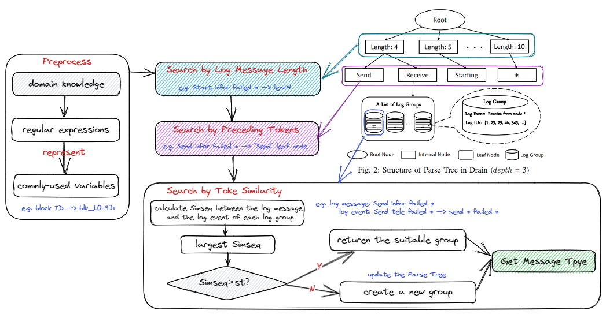
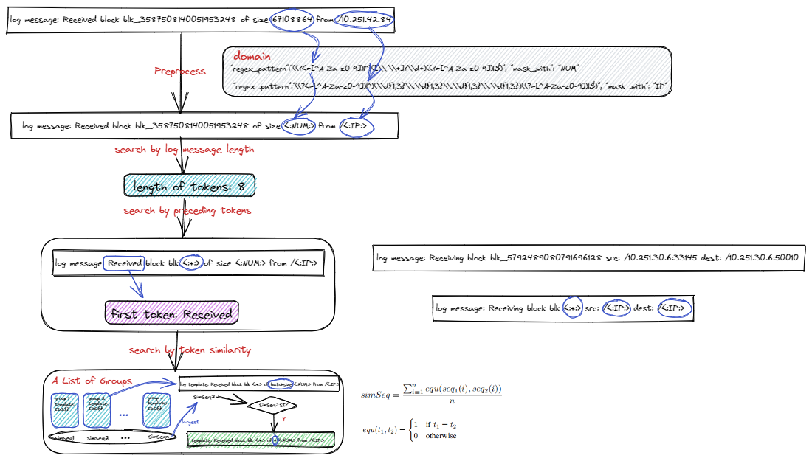

# Drain3 
 
## Algorithm introduction 
 
Drain is an online log parsing method proposed in 2017. Drain3 revamps Drain so that it can be used under Python3 and in actual production environments. The core idea of Drain3 is the same as Drain, which is based on the assumption that the number of words generated by the same log template is the same after word segmentation. A Parse Tree composed of the log length, prefix words, and log template is created under the word assumption 
 
## Use scenario 
 
This algorithm is suitable for 'real-time analysis and analysis' of logs, with high accuracy and efficiency 
 
## Algorithm principle 
 
 
 
For the input logs, regular expressions are used to replace common variables, and then words are divided. Logs are divided into different sub-nodes according to the length of the word segmentation, and then into different groups according to the first word segmentation. After the logs are divided into the corresponding log groups bucket, the similarity between the logs and the mode of each group will be calculated, and the maximum value will be compared with the threshold value. If the similarity is greater than the threshold value, the logs will be classified into the corresponding group, and the parts of the mode that are different from the logs will be replaced with *, and the mode will be returned. If the similarity is less than the threshold, a new group is created, the pattern of the group is the log itself, and it is returned. The following is an example of Drain3 mode discovery for logs 
 
 
 
 
## Paper link 
 
https://jiemingzhu.github.io/pub/pjhe_icws2017.pdf