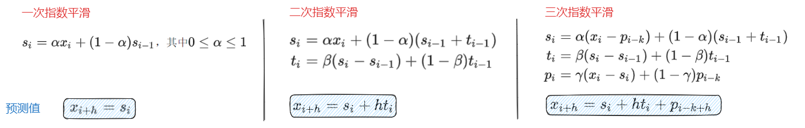

# Holt-Winter 
 
## Algorithm introduction 
 
The Holt-Winter method is actually three exponential smoothing. The closer to the predicted point, the greater the effect, so the weight according to the exponential attenuation, this is the basic idea of exponential smoothing. All exponential smoothing methods update the results of the previous time step calculation and use the new information contained in the current time step data by "mixing" the old and new information and controlling the weight of the old and new information. 
## Use scenario 
For three exponential smoothing methods: 
 
(1) An Exponential smoothing is aimed at sequences with  and no trend or seasonality ; 
(2) Holt exponential smoothing is a series of  with trend but no seasonal ; 
(3) Holt-Winters exponential smoothing is aimed at sequences with  and seasonal . 
Data should be preprocessed   before using Holt-Winter. 
 
## Algorithm principle 
 
 
In an exponentially smoothed recurrence relationship, it can be seen that the smoothed value at the time step i(i th time point) is the weighted sum of the actual data xi at the current time and the previously smoothed value si-1, and α controls the balance (weight) of the old and new information. All previous observations have an effect on the current smoothing value, but their role diminishes as the power of the parameter α increases, and the predicted value of an exponential smoothing is si. 
 
Quadratic exponential smoothing takes the trend as an additional consideration on this basis. It is necessary to update the state of the smoothed signal and the smoothed trend two quantities (the trend is processed by the first exponential smoothing, and β controls the balance). The predicted value takes the smoothed signal and trend into account at the same time and takes the last smoothed value. Each time step is then increased to add a final smoothing trend to the smoothing value. 
 
The three exponential smoothing increases the periodic pi and adds the seasonal component on the basis of the first two. At the same time, the seasonal component is also exponentially smoothed, and the forecast value takes into account all three.